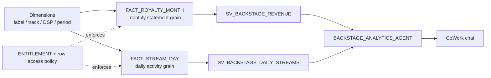

# Backstage Label Analytics


Pair-programmed by SE Community + Cortex Code

**Governed conversational analytics for a music label back office.** A label
operator asks a revenue or streaming question in plain language and gets an
answer scoped to exactly the labels they are entitled to see — enforced in the
data path by a row access policy, not by a prompt.

All data is synthetic. All labels, artists, and tracks are fictional.

> **Synthetic data and third-party names.** Every figure in this repository is
> generated. The streaming-service names in `DIM_DSP_SERVICE` — Spotify, Apple
> Music, YouTube, Amazon — are used descriptively, because the royalty reporting
> problem this demo models is only legible with recognizable distribution
> platforms. All revenue, stream counts, and reporting gaps attributed to them
> are invented and bear no relationship to any real platform's data or behavior.
> Those names are the trademarks of their respective owners. This project is not
> affiliated with, endorsed by, or sponsored by any of them.
>
> **About the expiry badge.** `Expires: 2026-10-22` appears in the badge above
> and in every file header. It is a content-freshness marker for demo hygiene,
> not a functional limit — nothing stops working on that date. It signals when
> the Snowflake feature surface used here should be re-verified against current
> documentation.

## Quick Start

1. Open **Snowsight → New Worksheet**
2. Paste `deploy_all.sql`, click **Run All** (~2 min)
3. Go to **AI & ML → Agents → BACKSTAGE_ANALYTICS_AGENT → Add to CoWork**
4. Ask: `What percentage of our 2025 Amazon revenue came from the recording QZSYN2400001?`

Expect **9.31%**, with the numerator and denominator shown. Asking by title
instead (`Neon Orchard`) is also worth trying — three recordings share that title,
so the agent will ask which one you mean rather than picking one.

`deploy_all.sql` is self-contained. No Git repository, API integration, stage, or
external file is required.

To remove everything: paste `teardown_all.sql` and Run All.

## The Five Questions

| # | Question | Model |
|---|---|---|
| 1 | What percentage of our 2025 Amazon revenue came from a given track? | Revenue |
| 2 | Which 50 labels had the largest month-over-month revenue increases? | Revenue |
| 3 | Show August streams for a track on Spotify, Apple Music, YouTube, and Amazon. | Daily streams |
| 4 | Give me a snapshot of the latest seven complete days for a track. | Daily streams |
| 5 | What was our highest streaming day for a song on Apple Music? | Daily streams |

Questions 1 and 2 are the reliable minimum. Question 3 is solid. Questions 4 and
5 are extensions — see `docs/RUNBOOK.md` for what was actually verified.

## Architecture



The two facts are never joined. A statement month is a reporting period; an
activity date is when a stream happened. Mixing them would duplicate measures
and produce answers that look right and are wrong.

## Definitions

These are decisions, not discoveries. They are stated here because a
conversational system is only trustworthy if the definitions behind its numbers
are fixed and visible.

| Term | Definition |
|---|---|
| Revenue | `LABEL_NET_USD` — net revenue attributable to the label after deductions. One basis, one column. |
| Currency | USD only. No conversion is performed or implied. |
| Reporting period | `STATEMENT_MONTH`, always the first day of the month. |
| Released period | A month with `IS_RELEASED = TRUE`. Unreleased months exist in the data and are excluded from user-facing answers. |
| Complete day | A day with `IS_COMPLETE = TRUE`. The most recent days are deliberately incomplete. |
| Track identity | `TRACK_KEY`, with a synthetic ISRC. Some titles collide on purpose so ambiguity has to be resolved. |
| DSP family | `DSP_FAMILY` rolls up raw service strings. Amazon spans three raw services and one family. |
| Label ownership | `LABEL_ID`, with `PARENT_LABEL_ID` for hierarchy. |
| Concentration | Numerator and denominator run the identical entitlement-scoped path. The denominator is labeled as revenue visible to the asker. |
| Label growth | Ranked by absolute increase. Missing prior month is NULL, not zero. Zero prior with positive current is flagged NEW, never infinite. |

## Access Model

Entitlements are modeled as **principal + permission + allowed label**, not as a
role alone and not as a union of everything a role could reach.

| Persona role | Scope |
|---|---|
| `BACKSTAGE_LABEL_BROAD` | All 75 labels, revenue and streaming |
| `BACKSTAGE_LABEL_LIMITED` | Three labels; one of them revenue-only, no streaming |
| `BACKSTAGE_LABEL_NONE` | No labels; every query returns empty |

A row access policy on both fact tables resolves the caller against
`ENTITLEMENT`. Lookup views inherit the same policy, so a user cannot discover
label or track names outside their scope. There is no admin bypass: `SYSADMIN`
sees everything because it holds entitlement rows, not because the policy exempts
it.

CoWork passes the real end-user identity, so this is genuine enforcement rather
than a simulated persona switch. See `docs/BOUNDARIES.md` for what is demo-only
and what production integration still requires.

## Testing

```sql
-- After deployment, in a worksheet:
!source tests/01_reference_queries.sql   -- expected values in docs/EXPECTED_RESULTS.md
!source tests/02_access_tests.sql        -- six access assertions
```

Or from a terminal:

```bash
bash tools/run_tests.sh --connection <your-connection>
```

Reference queries are hand-written against the base tables and were authored
before the semantic views existed, so they cannot inherit the semantic layer's
assumptions. Verified queries improve accuracy; they do not guarantee it. Four
genuine defects were found this way during the build, each producing a plausible
wrong number — see `docs/TEST_EVIDENCE.md`.

## Dataset

75 fictional labels, 600 recordings, 7 DSP services rolling up to 4 families.
Monthly royalty statements from 2024-01 to 2026-08 (93,403 rows) and daily
streaming activity from 2024-01-01 to 2026-09-21 (213,661 rows).

Generation is deterministic: every value is derived by hashing against a pinned
`DEMO_AS_OF`, so a rebuild produces identical data and the expected values stay
valid. The data is deliberately shaped to make specific behaviors demonstrable —
a three-way title collision, a seven-day DSP outage inside the August window, a
two-way tie at the streaming peak, incomplete trailing days, and an unreleased
statement month.

The two facts are generated independently and are **not** reconciled. Streams
multiplied by any rate will not equal revenue, because they stand in for two
source systems with different periods and deductions. That is realistic, and it is
why the grains must never be joined.

## Documentation

| File | Purpose |
|---|---|
| `docs/RUNBOOK.md` | Presenter walkthrough, exact prompts, expected results, reset, troubleshooting |
| `docs/EXPECTED_RESULTS.md` | Independently computed answers for all five questions |
| `docs/TEST_EVIDENCE.md` | Measured test and latency results |
| `docs/BOUNDARIES.md` | Demo-only versus production integration boundaries |
| `ELI5.md` | Plain-language explanation |
| `AGENTS.md` | Project conventions for AI tooling |

## Out of Scope

Deliberately excluded: Shopify ingestion and write-back, activation tooling,
email support automation, contract extraction, royalty-payment calculation,
forecasting, DSP per-plan rate estimates, and scheduled report delivery.
